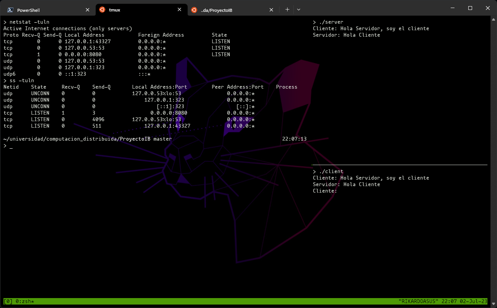

# Proyecto de Programación con Sockets

Este proyecto consiste en la implementación de un programa de chat utilizando sockets en el lenguaje de programación C. El objetivo del proyecto es desarrollar una aplicación distribuida que permita la comunicación entre clientes y un servidor a través de una red.

## Características principales

- El programa utiliza sockets para establecer la comunicación cliente-servidor.
- Los clientes pueden enviar mensajes al servidor, y el servidor muestra los mensajes recibidos en la consola.
- El programa es capaz de manejar múltiples conexiones simultáneas de forma concurrente.

## Requisitos

- Compilador de C compatible con el estándar ANSI C.
- Conexión a una red local o remota para probar la comunicación entre el cliente y el servidor.

## Instrucciones de uso

1. Clona el repositorio en tu máquina local:

   ```bash
   git clone https://github.com/Rikardo816/SocketsChat.git
   ```

2. Compila el programa del servidor:

   ```bash
   gcc servidor.c -o servidor
   ```

3. Compila el programa del cliente:

   ```bash
   gcc cliente.c -o cliente
   ```

4. Ejecuta el servidor:

   ```bash
   ./servidor
   ```

5. Ejecuta uno o varios clientes en diferentes terminales:

   ```bash
   ./cliente
   ```

6. Sigue las instrucciones en la consola para enviar mensajes y probar la comunicación.

## Capturas de pantalla

A continuación se muestran algunas capturas de pantalla del programa en funcionamiento:

  

## Contribuciones

Este proyecto es parte de un trabajo académico y no se aceptarán contribuciones externas en este momento.

## Licencia

Este proyecto se distribuye bajo la licencia [MIT](LICENSE).
